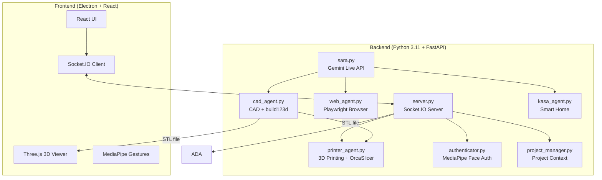

# SARA V2 - Asistente de Reconocimiento Avanzado


> **SARA** = **S**ophisticated **A**I **R**ecognition **A**ssistant (Asistente de Reconocimiento de IA Sofisticado)

SARA V2 es un asistente de IA sofisticado diseñado para la interacción multimodal. Combina el audio nativo de Gemini 2.5 de Google con visión por computadora, control por gestos y generación de CAD 3D en una aplicación de escritorio Electron.

---

## 🌟 Capacidades de un vistazo

| Característica | Descripción | Tecnología |
|---|---|---|
| **🗣️ Voz de Baja Latencia** | Conversación en tiempo real con manejo de interrupciones | Gemini 2.5 Native Audio |
| **🧊 CAD Paramétrico** | Generación de modelos 3D editables a partir de instrucciones de voz | `build123d` → STL |
| **🖨️ Impresión 3D** | Laminado y envío inalámbrico de trabajos de impresión | OrcaSlicer + Moonraker/OctoPrint |
| **🖐️ UI "Minority Report"** | Manipulación de ventanas controlada por gestos | MediaPipe Hand Tracking |
| **👁️ Autenticación Facial** | Inicio de sesión biométrico local seguro | MediaPipe Face Landmarker |
| **🌐 Agente Web** | Automatización autónoma del navegador | Playwright + Chromium |
| **🏠 Casa Inteligente** | Control por voz para dispositivos TP-Link Kasa | `python-kasa` |
| **📁 Memoria de Proyecto** | Contexto persistente entre sesiones | Almacenamiento JSON basado en archivos |

### 🖐️ Detalles del Control por Gestos

La interfaz estilo "Minority Report" de SARA utiliza tu cámara web para detectar gestos de la mano:

| Gesto | Acción |
|---|---|
| 🤏 **Pellizcar** | Confirmar acción / hacer clic |
| ✋ **Palma Abierta** | Soltar la ventana |
| ✊ **Puño Cerrado** | "Seleccionar" y agarrar una ventana de la interfaz para arrastrarla |

> **Consejo**: Habilita la ventana de transmisión de video para ver la superposición del seguimiento de manos.

---

## 🏗️ Resumen de la Arquitectura



---

## ⚡ TL;DR Inicio Rápido (Desarrolladores Experimentados)

<details>
<summary>Haga clic para expandir los comandos de configuración rápida</summary>

```bash
# 1. Clonar y entrar
git clone https://github.com/Jereff77/sara.git && cd sara

# 2. Crear entorno Python (Python 3.11)
conda create -n sara python=3.11 -y && conda activate sara
brew install portaudio  # solo macOS (para PyAudio)
pip install -r requirements.txt
playwright install chromium

# 3. Configurar frontend
npm install

# 4. Crear archivo .env
echo "GEMINI_API_KEY=tu_clave_aqui" > .env

# 5. ¡Ejecutar!
conda activate sara && npm run dev
```

</details>

---

## 🛠️ Requisitos de Instalación

### 🆕 Configuración para Principiantes Absolutos (Empieza Aquí)
Si nunca has programado antes, ¡sigue estos pasos primero!

**Paso 1: Instalar Visual Studio Code (El Editor)**
- Descarga e instala [VS Code](https://code.visualstudio.com/). Aquí es donde escribirás código y ejecutarás comandos.

**Paso 2: Instalar Anaconda (El Gestor)**
- Descarga [Miniconda](https://docs.conda.io/en/latest/miniconda.html) (una versión ligera de Anaconda).
- Esta herramienta nos permite crear "patios de recreo" (entornos) aislados para nuestro código para que diferentes proyectos no se rompan entre sí.
- **Usuarios de Windows**: Durante la instalación, marca "Add Anaconda to my PATH environment variable" (aunque diga que no se recomienda, facilita las cosas para los principiantes).

**Paso 3: Instalar Git (El Descargador)**
- **Windows**: Descarga [Git para Windows](https://git-scm.com/download/win).
- **Mac**: Abre la aplicación "Terminal" (Cmd+Espacio, escribe Terminal) y escribe `git`. Si no está instalado, te pedirá instalar herramientas de desarrollador—di que sí.

**Paso 4: Obtener el Código**
1. Abre tu terminal (o Símbolo del sistema en Windows).
2. Escribe este comando y presiona Enter:
   ```bash
   git clone https://github.com/Jereff77/sara.git
   ```
3. Esto crea una carpeta llamada `sara`.

**Paso 5: Abrir en VS Code**
1. Abre VS Code.
2. Ve a **Archivo > Abrir Carpeta**.
3. Selecciona la carpeta `sara` que acabas de descargar.
4. Abre la terminal interna: Presiona `Ctrl + ~` (tilde) o ve a **Terminal > Nueva Terminal**.

---

### ⚠️ Prerrequisitos Técnicos
Una vez que tengas los conceptos básicos anteriores, continúa aquí.

### 1. Dependencias del Sistema

**MacOS:**
```bash
# Soporte de Entrada/Salida de Audio (PyAudio)
brew install portaudio
```

**Windows:**
- ¡No se requieren dependencias adicionales del sistema!

### 2. Entorno Python
Crea un único entorno Python 3.11:

```bash
conda create -n sara python=3.11
conda activate sara

# Instalar todas las dependencias
pip install -r requirements.txt

# Instalar navegadores Playwright
playwright install chromium
```

### 3. Configuración del Frontend
Requiere **Node.js 18+** y **npm**. Descárgalo de [nodejs.org](https://nodejs.org/) si no está instalado.

```bash
# Verificar que Node está instalado
node --version  # Debería mostrar v18.x o superior

# Instalar dependencias del frontend
npm install
```

### 4. 🔐 Configuración de Autenticación Facial
Para utilizar las funciones de voz seguras, SARA necesita saber cómo te ves.

1. Toma una foto clara de tu cara (o usa una existente).
2. Cambia el nombre del archivo a `reference.jpg`.
3. Arrastra y suelta este archivo en la carpeta `sara/backend`.
4. (Opcional) Puedes activar/desactivar esta función en `settings.json` cambiando `"face_auth_enabled": true/false`.

---

## ⚙️ Configuración (`settings.json`)

El sistema crea un archivo `settings.json` en la primera ejecución. Puedes modificar esto para cambiar el comportamiento:

| Clave | Tipo | Descripción |
| :--- | :--- | :--- |
| `face_auth_enabled` | `bool` | Si es `true`, bloquea toda interacción de IA hasta que tu cara sea reconocida a través de la cámara. |
| `tool_permissions` | `obj` | Controla la aprobación manual para herramientas específicas. |
| `tool_permissions.generate_cad` | `bool` | Si es `true`, requiere que hagas clic en "Confirmar" en la UI antes de generar CAD. |
| `tool_permissions.run_web_agent` | `bool` | Si es `true`, requiere confirmación antes de abrir el agente del navegador. |
| `tool_permissions.write_file` | `bool` | **Crítico**: Requiere confirmación antes de que la IA escriba código/archivos en el disco. |

---

### 5. 🖨️ Configuración de Impresora 3D
SARA V2 puede laminar archivos STL y enviarlos directamente a tu impresora 3D.

**Hardware Soportado:**
- **Klipper/Moonraker** (Creality K1, Voron, etc.)
- Instancias de **OctoPrint**
- **PrusaLink** (Experimental)

**Paso 1: Instalar Laminador (Slicer)**
SARA utiliza **OrcaSlicer** (recomendado) o PrusaSlicer para generar código G.
1. Descarga e instala [OrcaSlicer](https://github.com/SoftFever/OrcaSlicer).
2. Ejecútalo una vez para asegurarte de que se creen los perfiles.
3. SARA detecta automáticamente la ruta de instalación.

**Paso 2: Conectar Impresora**
1. Asegúrate de que tu impresora y computadora estén en la **misma red Wi-Fi**.
2. Abre la **Ventana de Impresora** en SARA (icono de cubo).
3. SARA escanea automáticamente en busca de impresoras usando mDNS.
4. **Conexión Manual**: Si no se encuentra tu impresora, usa el botón "Añadir Impresora" e introduce la dirección IP (ej., `192.168.1.50`).

---

### 6. 🔑 Configuración de Clave API Gemini
SARA utiliza la API Gemini de Google para voz e inteligencia. Necesitas una clave API gratuita.

1. Ve a [Google AI Studio](https://aistudio.google.com/app/apikey).
2. Inicia sesión con tu cuenta de Google.
3. Haz clic en **"Create API Key"** y copia la clave generada.
4. Crea un archivo llamado `.env` en la carpeta `sara` (al mismo nivel que `README.md`).
5. Añade esta línea al archivo:
   ```
   GEMINI_API_KEY=tu_clave_api_aqui
   ```
6. Reemplaza `tu_clave_api_aqui` con la clave que copiaste.

> **Nota**: ¡Mantén esta clave privada! Nunca hagas commit de tu archivo `.env` a Git.

---

## 🚀 Ejecutando SARA V2

Tienes dos opciones para ejecutar la aplicación. ¡Asegúrate de que tu entorno `sara` esté activo!

### Opción 1: La Forma "Fácil" (Una Terminal)
La aplicación es lo suficientemente inteligente como para iniciar el backend por ti.
1. Abre tu terminal en la carpeta `sara`.
2. Activa tu entorno: `conda activate sara`
3. Ejecuta:
   ```bash
   npm run dev
   ```
4. El backend se iniciará automáticamente en segundo plano.

### Opción 2: La Forma "Desarrollador" (Dos Terminales)
Usa esto si quieres ver los registros de Python (recomendado para depuración).

**Terminal 1 (Backend):**
```bash
conda activate sara
python backend/server.py
```

**Terminal 2 (Frontend):**
```bash
# El entorno no importa aquí, pero mantenlo simple
npm run dev
```

---

## ✅ Lista de Verificación de Primer Vuelo (Cosas para Probar)

1. **Prueba de Voz**: Di "Hola Sara". Ella debería responder.
2. **Prueba de Visión**: Mira a la cámara. Si la Autenticación Facial está activada, la pantalla de bloqueo debería desbloquearse.
3. **Prueba de CAD**: Abre la ventana de CAD y di "Crea un cubo". Observa los registros.
4. **Prueba Web**: Abre la ventana del Navegador y di "Ve a Google".
5. **Casa Inteligente**: Si tienes dispositivos Kasa, di "Enciende las luces".

---

## ▶️ Referencia de Comandos y Herramientas

### 🗣️ Comandos de Voz
- "Cambia el proyecto a [Nombre]"
- "Crea un nuevo proyecto llamado [Nombre]"
- "Enciende la luz de [Habitación]"
- "Pon la luz de color [Color]"
- "Pausa el audio" / "Detén el audio"

### 🧊 CAD 3D
- **Instrucción**: "Crea un modelo 3D de un perno hexagonal."
- **Iterar**: "Haz la cabeza más delgada." (Requiere contexto previo)
- **Archivos**: Guarda en `projects/[NombreProyecto]/output.stl`.

### 🌐 Agente Web
- **Instrucción**: "Ve a Amazon y busca un cable USB-C por menos de $10."
- **Nota**: El agente hará scroll, clic y escribirá automáticamente. No interfieras con la ventana del navegador mientras se ejecuta.

### 🖨️ Impresión y Laminado
- **Auto-Descubrimiento**: SARA encuentra automáticamente impresoras en tu red.
- **Laminado**: Haz clic en "Laminar e Imprimir" en cualquier modelo 3D generado.
- **Perfiles**: SARA selecciona inteligentemente el perfil correcto de OrcaSlicer basado en el nombre de tu impresora (ej., "Creality K1").

---

## ❓ Preguntas Frecuentes (FAQ)

### La cámara no funciona / Acceso denegado (Mac)
**Síntomas**: Error sobre acceso a la cámara, o la transmisión de video se ve negra.

**Solución**:
1. Ve a **Preferencias del Sistema > Privacidad y Seguridad > Cámara**.
2. Asegúrate de que tu aplicación de terminal (ej., Terminal, iTerm, VS Code) tenga acceso a la cámara habilitado.
3. Reinicia la aplicación después de conceder el permiso.

---

### `GEMINI_API_KEY` no encontrada / Error de Autenticación
**Síntomas**: El backend se bloquea al inicio con "API key not found".

**Solución**:
1. Asegúrate de que tu archivo `.env` esté en la carpeta raíz `sara` (no dentro de `backend/`).
2. Verifica que el formato sea exactamente: `GEMINI_API_KEY=tu_clave` (sin comillas, sin espacios).
3. Reinicia el backend después de editar el archivo.

---

### Errores de conexión WebSocket (1011)
**Síntomas**: `websockets.exceptions.ConnectionClosedError: 1011 (internal error)`.

**Solución**:
Esto es un problema del lado del servidor de la API de Gemini. Simplemente reconecta haciendo clic en el botón de conectar o diciendo "Hola SARA" de nuevo. Si persiste, verifica tu conexión a internet o intenta de nuevo más tarde.

---

## 📸 Cómo se Ve

*¡Próximamente! Se añadirán capturas de pantalla y videos de demostración aquí.*

---

## 📂 Estructura del Proyecto

```
sara/
├── backend/                    # Servidor Python y lógica de IA
│   ├── ada.py                  # Integración API Gemini Live
│   ├── server.py               # Servidor FastAPI + Socket.IO
│   ├── cad_agent.py            # Orquestador de generación CAD
│   ├── printer_agent.py        # Descubrimiento de impresora 3D y laminado
│   ├── web_agent.py            # Automatización de navegador Playwright
│   ├── kasa_agent.py           # Control de casa inteligente TP-Link
│   ├── authenticator.py        # Lógica de autenticación facial MediaPipe
│   ├── project_manager.py      # Gestión de contexto de proyecto
│   ├── tools.py                # Definiciones de herramientas para Gemini
│   └── reference.jpg           # Tu foto de cara (¡añade esto!)
├── src/                        # Frontend React
│   ├── App.jsx                 # Componente principal de la aplicación
│   ├── components/             # Componentes de UI (11 archivos)
│   └── index.css               # Estilos globales
├── electron/                   # Proceso principal de Electron
│   └── main.js                 # Configuración de ventana e IPC
├── projects/                   # Datos de proyectos de usuario (auto-creado)
├── .env                        # Claves API (¡crea esto!)
├── requirements.txt            # Dependencias Python
├── package.json                # Dependencias Node.js
└── README.md                   # ¡Estás aquí!
```

---

## ⚠️ Limitaciones Conocidas

| Limitación | Detalles |
|---|---|
| **macOS y Windows** | Probado en macOS 14+ y Windows 10/11. Linux no probado. |
| **Cámara Requerida** | La autenticación facial y el control por gestos necesitan una cámara web funcional. |
| **Cuota API Gemini** | El nivel gratuito tiene límites de tasa; la iteración pesada de CAD puede alcanzar los límites. |
| **Dependencia de Red** | Requiere internet para la API de Gemini (sin modo offline). |
| **Usuario Único** | La autenticación facial reconoce a una persona (el `reference.jpg`). |

---

## 🤝 Contribuir

¡Las contribuciones son bienvenidas! Aquí se explica cómo:

1. **Fork** el repositorio.
2. **Crea una rama**: `git checkout -b feature/caracteristica-asombrosa`
3. **Commit** tus cambios: `git commit -m 'Añadir caracteristica asombrosa'`
4. **Push** a la rama: `git push origin feature/caracteristica-asombrosa`
5. **Abre un Pull Request** con una descripción clara.

### Consejos de Desarrollo

- Ejecuta el backend por separado (`python backend/server.py`) para ver los registros de Python.
- Usa `npm run dev` sin Electron durante el desarrollo del frontend (recarga más rápida).

---

## 🐳 Ejecutar con Docker

Puedes ejecutar el entorno de desarrollo utilizando Docker Compose. Esto levantará el backend y el frontend (versión web) en contenedores.

### Requisitos Previos
- Docker Desktop instalado y ejecutándose.
- Archivo `.env` configurado con tu `GEMINI_API_KEY`.

### Pasos
1. Construir y levantar los contenedores:
   ```bash
   docker-compose up --build
   ```

2. Acceder a la aplicación:
   - **Frontend (Web)**: [http://localhost:5173](http://localhost:5173)
   - **Backend API**: [http://localhost:8000](http://localhost:8000)

### Notas sobre Docker
- **Hardware**: El acceso a la cámara y al micrófono desde Docker en Windows/Mac tiene limitaciones significativas y puede no funcionar directamente sin configuración avanzada (paso de dispositivos USB, X11 forwarding, etc.).
- **Electron**: Esta configuración ejecuta la versión **Web** de la interfaz (React + Vite), no la aplicación de escritorio Electron.
- **Persistencia**: El código fuente se monta como volumen, por lo que los cambios en tu editor local se reflejarán en el contenedor (Hot Reloading).

## ☁️ Despliegue en EasyPanel (Producción)

Para desplegar en EasyPanel u otros orquestadores como Coolify/Portainer, utiliza la configuración de producción.

1.  **Archivo Compose**: Utiliza `docker-compose.prod.yml`.
2.  **Configuración**:
    *   **Backend**: Persistencia de datos configurada para `projects/`, `long_term_memory/` y `logs/`.
    *   **Frontend**: Servido vía Nginx en el puerto 80.
3.  **Variables de Entorno**: Asegúrate de añadir tu `GEMINI_API_KEY` en el panel de configuración de EasyPanel.

**Nota Importante**: En producción, la aplicación Web no tendrá acceso a dispositivos locales (micrófono/cámara) del servidor. El acceso dependerá del navegador del cliente (tu PC/móvil), pero la funcionalidad de servidor (como control de dispositivos Kasa locales del servidor) funcionará si están en la misma red.

